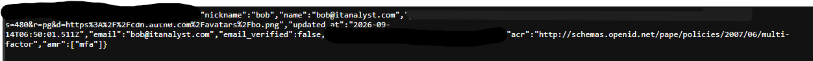
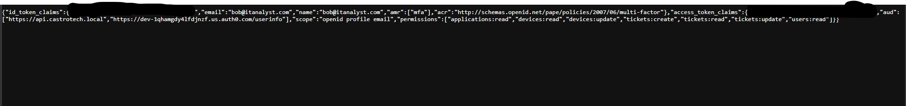
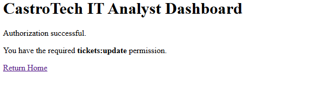
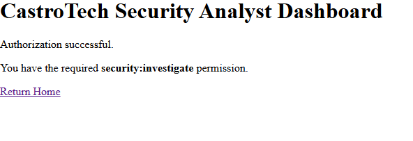
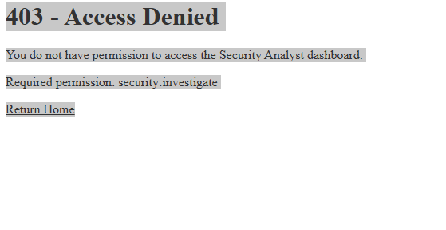
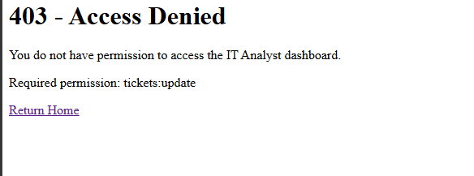
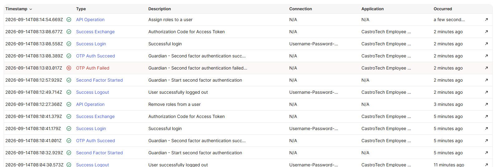

# CastroTech Enterprise IAM Security Lab

## Overview

The **CastroTech Enterprise IAM Security Lab** is a hands-on Identity and Access Management (IAM) project designed to simulate how an organization can securely manage employee identities, authentication, authorization, privileged access, and identity-related security events.

The lab uses **Auth0** as the identity provider and a custom **Node.js / Express** application as the fictional CastroTech Employee Portal.

Rather than implementing authentication alone, this project demonstrates how multiple IAM security controls work together, including:

- Identity provisioning
- Role-Based Access Control (RBAC)
- Least privilege
- Separation of duties
- Multi-Factor Authentication (MFA)
- OAuth 2.0 Authorization Code Flow
- OpenID Connect (OIDC)
- JWT access token validation
- Permission-based authorization
- Identity lifecycle management
- Access revocation
- IAM logging and security investigation

The goal of the project was to create an enterprise-style IAM environment where authenticated users receive access based on their assigned job responsibilities rather than authentication alone.

---

## Lab Scenario

**CastroTech** is a fictional organization created for this cybersecurity lab.

The organization has employees performing different business, IT, and security responsibilities.

Three test identities were provisioned in Auth0:

| User | Assigned Role | Primary Responsibility |
|---|---|---|
| Alice | Standard Employee | General employee and support-ticket access |
| Bob | IT Analyst | IT support, device, user, and application operations |
| Charlie | Security Analyst | Security monitoring, investigation, and response |

Each user was assigned a role containing permissions appropriate to their job responsibilities.

This allowed the lab to test both successful and denied authorization attempts and demonstrate **least privilege** and **separation of duties**.

---

## Architecture

The lab environment consists of the following components:

### Identity Provider

**Auth0**

Auth0 provides:

- User identity management
- Authentication
- Role assignments
- Permission management
- MFA
- OAuth 2.0 / OpenID Connect
- Security and authentication logs

### Employee Application

**CastroTech Employee Portal**

Built with:

- Node.js
- Express.js
- `express-openid-connect`

The portal uses Auth0 to authenticate users and establish authenticated application sessions.

### Protected API

**CastroTech Enterprise API**

API audience:

```text
https://api.castrotech.local
```

The API was configured with Auth0 RBAC and permission claims in access tokens.

### Token Validation

Protected application routes use:

```text
express-oauth2-jwt-bearer
```

Access tokens are validated before authorization decisions are made.

The application verifies the token and then evaluates the permissions contained in the verified token payload.

---

## Identity Provisioning

Three fictional employee identities were created to represent different levels of organizational access.

```text
Alice
└── Standard Employee

Bob
└── IT Analyst

Charlie
└── Security Analyst
```

The identities were then associated with Auth0 roles containing permissions appropriate to their responsibilities.

This creates the following authorization model:

```text
User
  ↓
Role
  ↓
Permissions
  ↓
Access Token
  ↓
Protected Resource
```

Instead of assigning unrestricted access directly to users, permissions are grouped through roles.

---

## Role-Based Access Control

Auth0 RBAC was enabled for the **CastroTech Enterprise API**.

The option to include permissions in access tokens was also enabled so the application could make authorization decisions using the permissions contained in a validated access token.

### Standard Employee

Assigned permissions:

```text
profile:read
tickets:create
tickets:read
```

This role represents a normal employee who can view basic employee information and interact with the support-ticket system.

---

### IT Analyst

Assigned permissions:

```text
tickets:read
tickets:create
tickets:update
users:read
devices:read
devices:update
applications:read
```

The IT Analyst can perform IT support functions such as managing support tickets and reviewing or updating device-related information.

The role does **not** receive security investigation or security response permissions.

---

### Security Analyst

Assigned permissions:

```text
security:read
security:investigate
security:respond
users:read
devices:read
applications:read
```

The Security Analyst can review and investigate security-related activity.

The role does **not** receive IT ticket modification privileges such as:

```text
tickets:update
```

---

## Least Privilege and Separation of Duties

The RBAC model was intentionally designed so that users receive only the permissions necessary for their assigned responsibilities.

For example:

```text
IT Analyst
    ├── Can update IT tickets
    └── Cannot perform security investigations

Security Analyst
    ├── Can perform security investigations
    └── Cannot update IT tickets
```

This demonstrates two important IAM principles:

**Least Privilege**

Users receive only the permissions necessary to perform their job responsibilities.

**Separation of Duties**

IT administration and security investigation capabilities are separated between different roles rather than being concentrated under one account.

---

## Authentication and Multi-Factor Authentication

The CastroTech Employee Portal authenticates users through Auth0.

The application uses the **OAuth 2.0 Authorization Code Flow** with OpenID Connect.

Multi-Factor Authentication was enabled using **One-Time Password (OTP)** authentication.

For this lab environment, Auth0 MFA was configured with the:

```text
Always
```

policy.

This requires users authenticating through the tenant to complete the configured second authentication factor.

Successful MFA authentication was observable through authentication claims such as:

```json
{
  "amr": ["mfa"]
}
```

The authentication context also contained an `acr` value indicating that multi-factor authentication occurred.

### MFA Evidence



---

## OAuth 2.0 and OpenID Connect

The project demonstrates the difference between **authentication** and **API authorization**.

### OpenID Connect

OIDC is used to identify the authenticated user.

Relevant identity claims observed during the lab included:

```text
sub
email
name
amr
acr
```

These claims provide information about the authenticated identity and authentication context.

### OAuth 2.0 Access Token

The OAuth access token is used for authorization against the CastroTech Enterprise API.

Relevant access-token claims included:

```text
sub
aud
scope
permissions
```

The application includes:

```text
/oidc-analysis
```

to demonstrate the distinction between identity-related claims and API authorization claims.

### OIDC / OAuth Evidence



---

## JWT Access Token Validation

A major security objective of the project was to avoid making authorization decisions based solely on an unverified, decoded JWT payload.

Protected routes use:

```text
express-oauth2-jwt-bearer
```

to validate the access token before its permissions are trusted.

The validation process checks:

- JWT signature
- Token issuer
- API audience

The expected audience is:

```text
https://api.castrotech.local
```

After successful validation, authorization decisions are made using permissions from the verified token payload.

The project also includes the route:

```text
/api/verified
```

which was used to confirm successful access-token verification.

### JWT Verification Evidence


---

## Permission-Based Authorization Testing

Two protected application routes were created to test RBAC enforcement.

### IT Analyst Dashboard

Route:

```text
/it-dashboard
```

Required permission:

```text
tickets:update
```

Bob was assigned the **IT Analyst** role and possessed the required permission.

Result:

```text
Bob → IT Analyst Dashboard → ACCESS GRANTED
```

### Evidence



---

### Security Analyst Dashboard

Route:

```text
/security-dashboard
```

Required permission:

```text
security:investigate
```

Charlie was assigned the **Security Analyst** role and possessed the required permission.

Result:

```text
Charlie → Security Analyst Dashboard → ACCESS GRANTED
```

### Evidence



---

### Unauthorized Security Dashboard Attempt

Bob's IT Analyst role does not contain:

```text
security:investigate
```

When Bob attempted to access the Security Analyst dashboard, the application rejected the request.

Result:

```text
Bob → Security Analyst Dashboard → 403 ACCESS DENIED
```

### Evidence



These tests demonstrate that **successful authentication does not automatically authorize a user to access every protected resource**.

The authenticated identity must also possess the permission required by the requested resource.

---

## Identity Lifecycle and Access Revocation

The lab also simulated a privileged-access lifecycle event.

Bob initially possessed the:

```text
IT Analyst
```

role.

To simulate the removal of privileged access, the IT Analyst role was removed from Bob's Auth0 identity.

Bob then logged out and authenticated again, causing a new access token to be issued based on his updated authorization state.

Bob attempted to access:

```text
/it-dashboard
```

which requires:

```text
tickets:update
```

Because the IT Analyst role had been removed, Bob no longer possessed the required permission.

The application returned:

```text
403 - Access Denied

Required permission: tickets:update
```

### Access Revocation Evidence



This demonstrates the identity lifecycle relationship:

```text
Role Revoked
     ↓
Privileges Removed
     ↓
New Authentication
     ↓
New Access Token
     ↓
Permission No Longer Present
     ↓
Protected Resource Denied
```

Bob's IT Analyst role was restored after the lifecycle-management test was completed.

---

## IAM Security Investigation

The final phase of the project involved reviewing Auth0 monitoring logs to investigate identity and authentication activity generated during the lab.

The logs provided a timeline of IAM-related events.

Observed activity included:

```text
Role removal
      ↓
User logout
      ↓
MFA challenge started
      ↓
OTP authentication failed
      ↓
OTP authentication succeeded
      ↓
Successful login
      ↓
Authorization Code exchanged for Access Token
      ↓
Role assignment
```

These events demonstrate how IAM logs can help a security analyst reconstruct authentication, MFA, token issuance, and privilege-management activity.

### Investigation Evidence



This portion of the lab demonstrates how identity-provider telemetry can support security monitoring and incident investigation.

---

## Security Controls Demonstrated

| Security Control | Implementation |
|---|---|
| Identity Management | Auth0 user identities |
| Authentication | Auth0 / OpenID Connect |
| Multi-Factor Authentication | OTP MFA |
| Authorization | OAuth 2.0 access tokens |
| RBAC | Auth0 roles and permissions |
| Least Privilege | Job-specific permission assignments |
| Separation of Duties | IT and Security privileges separated |
| Token Security | JWT signature, issuer, and audience validation |
| Application Access Control | Permission-protected Express routes |
| Identity Lifecycle | Role assignment and revocation |
| Access Revocation | Removal of IT privileges followed by denied access |
| Security Monitoring | Auth0 authentication and administrative logs |
| IAM Investigation | Reconstruction of authentication and role events |

---

## Application Routes

The Node.js application contains several routes used throughout the lab.

| Route | Purpose |
|---|---|
| `/` | CastroTech Employee Portal home page |
| `/profile` | Displays authenticated OIDC user information |
| `/token-claims` | Displays selected access-token claims for lab analysis |
| `/oidc-analysis` | Compares identity and access-token claims |
| `/it-dashboard` | IT Analyst protected resource |
| `/security-dashboard` | Security Analyst protected resource |
| `/api/verified` | Demonstrates successful JWT validation |

The `/token-claims` and `/oidc-analysis` routes are educational inspection routes used to understand token contents.

Authorization decisions for protected resources are performed using validated access-token claims.

---

## Security Considerations

Sensitive Auth0 configuration values are stored in environment variables rather than directly in the source code.

The project's `.gitignore` excludes:

```text
.env
.env.*
node_modules/
```

Sensitive values such as the following are therefore not intended to be committed to the repository:

```text
AUTH0_SECRET
AUTH0_CLIENT_SECRET
```

The application also avoids intentionally displaying raw bearer access tokens in the lab evidence.

Although JWT payloads are decoded for educational inspection in specific analysis routes, **decoded claims are not trusted for protected-route authorization**.

Protected authorization routes validate the access token before using its permission claims.

---

## Technologies Used

- Auth0
- Node.js
- Express.js
- JavaScript
- OAuth 2.0
- OpenID Connect
- JSON Web Tokens (JWT)
- Role-Based Access Control (RBAC)
- Multi-Factor Authentication (MFA)
- Git
- GitHub

---

## Skills Demonstrated

This project provided hands-on experience with:

- Configuring an identity provider
- Provisioning user identities
- Designing enterprise-style roles
- Creating granular API permissions
- Assigning roles to users
- Implementing RBAC
- Applying least privilege
- Applying separation of duties
- Configuring MFA
- Integrating Auth0 with a Node.js application
- Implementing OAuth 2.0 Authorization Code Flow
- Working with OIDC identity claims
- Analyzing OAuth access-token claims
- Validating JWT access tokens
- Enforcing server-side authorization
- Testing authorized and unauthorized access
- Revoking privileged access
- Reviewing IAM audit logs
- Investigating authentication and authorization events
- Protecting application secrets with environment variables

---

## Key Takeaways

This project demonstrates that IAM security involves more than verifying a username and password.

A user must move through multiple security layers:

```text
Identity
   ↓
Authentication
   ↓
Multi-Factor Authentication
   ↓
OAuth / OIDC
   ↓
Access Token
   ↓
JWT Validation
   ↓
Role and Permission Evaluation
   ↓
Authorized Resource Access
```

The lab demonstrates how authentication, authorization, RBAC, least privilege, MFA, token validation, identity lifecycle management, and security monitoring work together to protect enterprise applications.

It also demonstrates that access can be dynamically affected by changes to an identity's assigned roles and that identity-provider logs can provide valuable evidence during a security investigation.

---

## Project Evidence

The `Screenshots` directory contains evidence collected throughout the lab:

```text
Screenshots/
├── lab-04-bob-it-access-granted.png
├── lab-04-bob-security-access-denied.png
├── lab-04-charlie-security-access-granted.png
├── lab-06-bob-mfa-authentication.png
├── lab-07-oidc-oauth-token-analysis.png
├── lab-08-jwt-access-token-verification.png
├── lab-10-bob-role-revoked-access-denied.png
└── lab-11-auth0-iam-security-investigation.png
```

The screenshots demonstrate successful and denied authorization, MFA authentication, OAuth/OIDC token analysis, JWT validation, access revocation, and IAM security-log investigation.

---

## Disclaimer

**CastroTech is a fictional organization created solely for cybersecurity training and portfolio demonstration purposes.**

All users, roles, application data, API identifiers, and organizational scenarios used in this project are simulated.